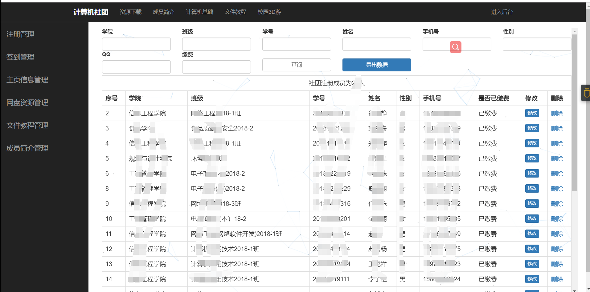

## 计算机社团人员管理系统

由于v1.0版本源码丢失，只能上传v2.0和v3.0版本源码，

v1.0版本：使用的是原生jsp，里面所有的操作全部在jsp页面，手里只有一个可部署的编译之后的文件，有需要的同学，留言即可

v2.0版本：对应上传的ComSociety和ComputerSociety，两个版本目前已无法分清，应该都是，所有的数据库文件都是在根目录下面的student.sql

v3.0版本：对应上传的computer，使用SSH框架，集合Maven项目管理工具，具体参考对应的pdf

#### v3.0项目环境

jdk：1.8

IDE：idea2018.2.4

Web服务器：Tomcat9.0（若需要进行负载均衡，可使用nginx）

maven：apache-maven-3.6.1

项目打包：mvn package

sql文件：student.sql

#### v3.0项目整体效果

项目地址： http://211.67.160.21:8080/computer/jsp/index 

#### v3.0系统快速部署

1.clone项目到本地

2.数据库脚本放在根目录下，在MySQL中执行数据库脚本

3.数据库配置在computer项目的resources目录下的jdbc.properties文件中

4.在IntelliJ IDEA中运行computer项目

 **OK，至此，整个系统就启动成功了，此时我们直接在地址栏输入`http://localhost/index`即可访问我们的项目** 